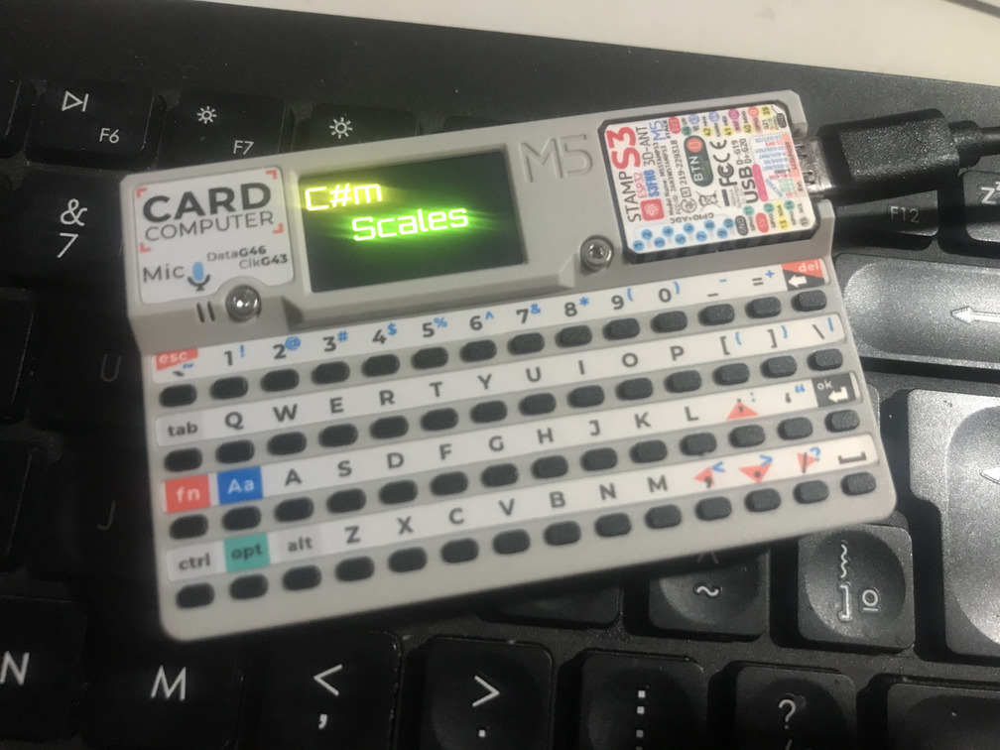

# M5 Synth

This is a simple project I created to study some of the audio capabilities of the M5Stack devices.

## Synth Scales
> Targeted/tested device: **M5Cardputer**.
>
>`Speaker` and `Keyboard` are required.

The very first project I created for the M5Cardputer.
It's a simple demo for playing some notes (using the `Speaker`) of a particular musical scale.

- Notes can be played by pressing the <kbd>1</kbd>~<kbd>8</kbd> number keys on the keyboard.
- The **Key** can be changed by pressing <kbd>◂</kbd> or <kbd>▸</kbd> on the keyboard.
- Reset to the default Key (C4) by pressing <kbd>esc</kbd> on the keyboard.
- Major and Minor scales can be toggled by pressing <kbd>M</kbd> on the keyboard.
- Volume can be adjusted by pressing <kbd>▴</kbd> or <kbd>▾</kbd> on the keyboard.

## Synth Midi
> Targeted/tested device: **M5Cardputer** and **M5StickC Plus 2** (may work with **M5StickC Plus**, but has not been tested).
>
>`Speaker` (`Buzzer` for the M5StickC Plus 2), `BLE` and a Bluetooth Midi Controller required.
>
> External lib required: https://github.com/max22-/ESP32-BLE-MIDI

After creating the previous demo, I tried to create something similar but with Midi support.
It's still just a simple demo for playing some notes (and chords), but now with more flexibility.

- After booting, the program will scan for Midi controllers and automatically connect to the first one it finds.
- Press the <kbd>BtnA</kbd> button to toggle between sine and square wave instruments.
- Press the <kbd>BtnB</kbd> button (M5StickC only) to flip the screen.
- Only note on/off messages have been implemented.

